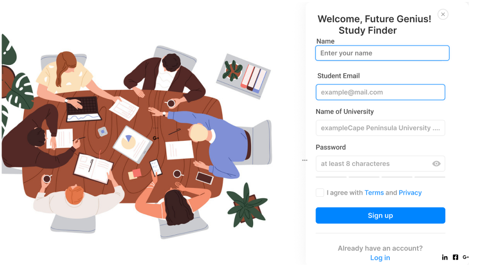
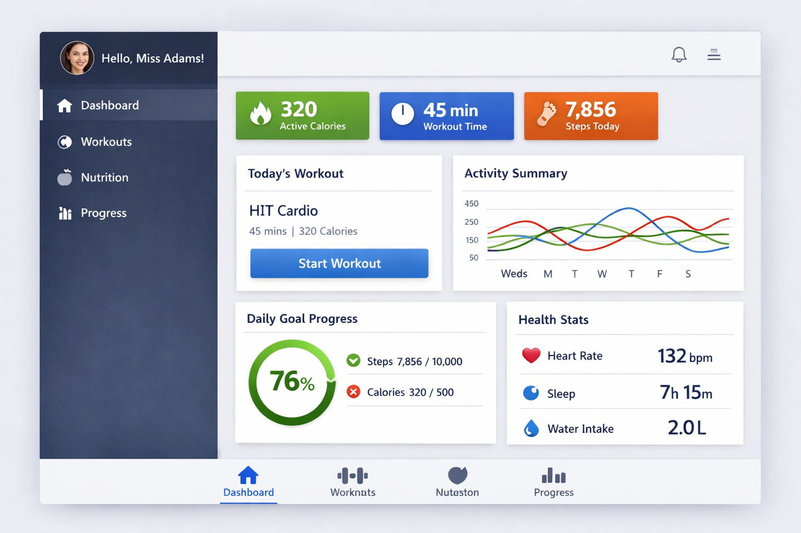
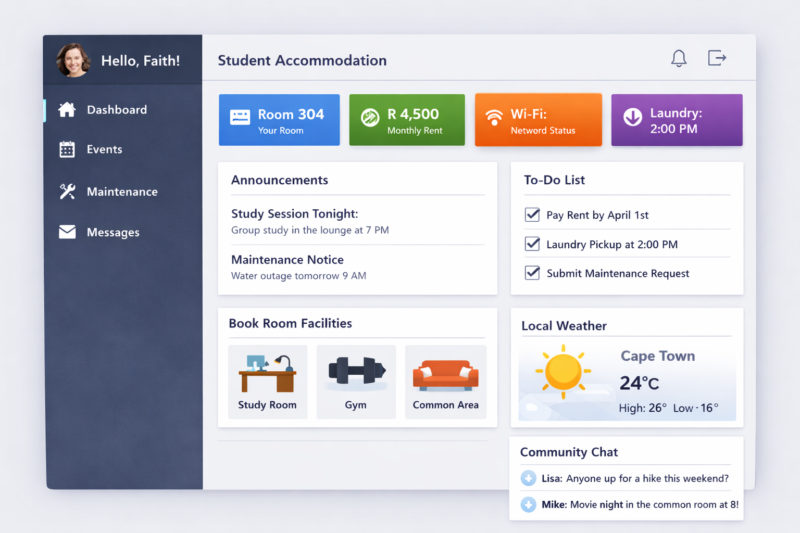
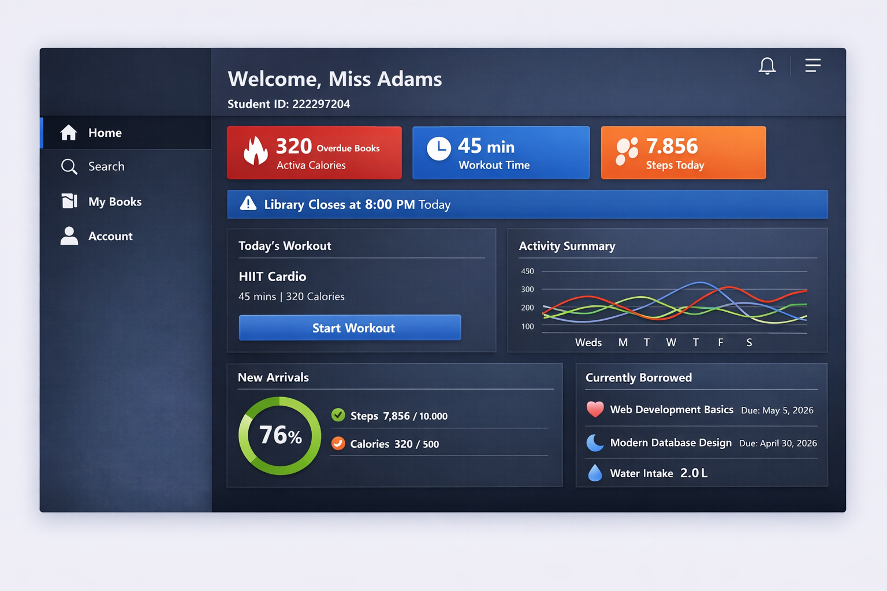

# Faith Adams- Github Portfolio

## Live Portfolio Website
https://FaithA965.github.io

---

## About This Portfolio
This portfolio was created as part of the GitHub Portfolio (WIL Career Preparedness Assignment). It showcases my skills, projects, and professional development using GitHub and Markdown.

---

## Career Objective
I am a passionate IT student seeking a Work Integrated Learning (WIL) opportunity where I can apply my technical skills, gain industry experience, and grow in the tech industry.

---

##  Contact Details
- Email: 2222297204@mycput.ac.za  
- Phone: 060 178 9341  
- Location: Cape Town, South Africa  
- LinkedIn: https://linkedin.com/in/faith-adams-0247b4300  
- GitHub: https://github.com/FaithA965  

---

## Education
- Gansbaai Academia (2017–2021)  
- Rosebank College (2022–2023)  
- Cape Peninsula University of Technology (Current – 2026)

---

##  Technical Skills
- Java, C#, Python  
- HTML, CSS, JavaScript  
- SQL  
- GitHub, Visual Studio Code, NetBeans  
- MySQL, Thonny  
- OOP, SDLC, Debugging, Testing  

---

##  Projects

###  Study Finder App
- Description: Helps students locate study spaces on campus  
- Technologies: Java, Firebase  

---

### Fitness App
- Description: Tracks workouts and fitness progress  
- Technologies: Java, Android Studio  

---

### Student Accommodation App
- Description: Helps students find and manage accommodation  
- Technologies: Java, MySQL  

---

### Library Management System
- Description: Manages books, borrowing, and return records  
- Technologies: Java, SQL  

---

## Mock Interview Video
 mock-interview.mp4

---

##  Reflection
Through this portfolio, I have developed important skills such as communication, problem-solving, and technical confidence. I have also improved my ability to use GitHub for version control and documentation.

This assignment helped me understand how to present my work professionally and prepare for real-world opportunities in the IT industry.

---

##  Repository Contents
- README.md  
- Project screenshots  
- Mock interview video  

---

##  License
This portfolio is for academic and Work Integrated Learning (WIL) assessment purposes only.
